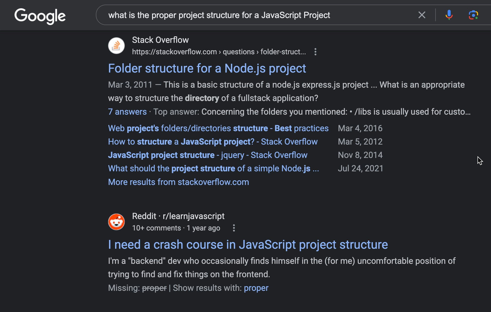

# Github Copilot as a reaseach assistant
The GitHub Copilot extension is an AI pair programmer tool that helps you write code faster and smarter. You can use the Copilot extension in Visual Studio Code to generate code, learn from the code it generates, and even configure your editor.

## Search engine vs AI Assistant
You can also think of CP as your research assistant.
Everyone has used a search engine or forum to perform research. The issue is, it requires quite a bit of hunting and picking to get the final result you need. Changing search terms, or just reading many pages of forum posts. Thsi is very time consuming.

For example, you might perform a search and get results similiar to this:



However, leveraging Copilot, we can get direct results in the ide and even get actionable elements that speed up our overall workflow.

### In Copilot, add the following prompt to see the difference in results:

```text
@workspace what is the proper project structure for a JavaScript Project
```


## General IT 
You can begin a dialog with copilot on virtually anything

### Prompt:
```text
What is OO
```

### Prompt:
```text
What is SOLID
```

### Prompt:
```text
What is ACID
```

### Prompt:
```text
What are some language for web development
```

### Prompt:
```text
summarize https://en.wikipedia.org/wiki/HTTP%2F2
```


Note that after each prompt, copilot suggests what it believes to be the next question you might want to ask.


---

#### [./back](./README.md)
