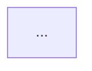

# Creating Mermaid Chart Diagrams with GitHub Copilot

Creating Mermaid chart diagrams with GitHub Copilot can significantly streamline the process of generating visual representations of your ideas, from flowcharts to sequence diagrams and beyond. Mermaid is a JavaScript-based tool that allows you to render diagrams and charts through simple text definitions, making it a fantastic tool for documentation and README files on GitHub. GitHub Copilot, powered by OpenAI technology, acts as an AI pair programmer, suggesting code and documentation in real-time. Here's how to use GitHub Copilot to create Mermaid diagrams:

## Prerequisites
- Ensure you have GitHub Copilot activated in your GitHub account. Copilot is available as an extension for Visual Studio Code, which you can download and install from the Visual Studio Marketplace.
- Familiarity with basic GitHub operations and Markdown syntax will be helpful.
- Install Node.js and npm (Node Package Manager) if you plan to preview your Mermaid diagrams locally.

## Step 1: Setting Up Your Environment
First, if you don't already have Visual Studio Code (VS Code), download and install it from the official website. Next, install the GitHub Copilot extension:
1. Open VS Code.
2. Go to the Extensions view by clicking on the square icon on the sidebar or pressing `Ctrl+Shift+X`.
3. Search for "GitHub Copilot" and click on the install button.

## Step 2: Creating a Markdown File for Your Diagram
1. In VS Code, open or create a GitHub repository where you want to add a Mermaid diagram.
2. Create a new Markdown file (`.md` extension) where you'll write the Mermaid diagram code. For example, `diagram.md`.

## Step 3: Writing Mermaid Syntax with GitHub Copilot
1. Start typing your diagram definition by first indicating that you'll be using Mermaid. In your Markdown file, type the following:

```t



1. After typing \`\`\`mermaid, press Enter to move to the next line. GitHub Copilot should start suggesting Mermaid syntax. If you have a specific type of diagram in mind (e.g., flowchart, sequence diagram), start typing the definition for that diagram. For example, type `graph TD;` to start a flowchart.
2. As you type, GitHub Copilot will suggest continuations. Accept a suggestion by pressing `Tab` or `Enter`. If the suggestion isn't quite right, keep typing to refine it, or use `Ctrl+Space` to trigger suggestions manually.

## Step 4: Refining and Completing Your Diagram
Continue to define your diagram by adding nodes, edges, and other Mermaid syntax elements. GitHub Copilot can suggest labels, styles, and even complex structures based on what you've already typed. Review Copilot's suggestions carefully to ensure they align with your intended diagram structure.

## Step 5: Previewing Your Diagram
To preview your Mermaid diagram:
- **Directly on GitHub**: Commit and push your Markdown file to a GitHub repository. GitHub natively supports rendering Mermaid diagrams in Markdown files.
- **Locally in VS Code**: Install a Markdown preview extension that supports Mermaid diagrams, such as "Markdown Preview Mermaid Support," from the VS Code Extensions Marketplace.

## Step 6: Iteration and Improvement
Use GitHub Copilot's suggestions to experiment with different types of diagrams and refine existing ones. The AI might offer creative solutions or optimizations for your diagrams that you hadn't considered.

## Conclusion
GitHub Copilot can significantly accelerate the creation of Mermaid diagrams by suggesting syntax and structure as you type. This allows you to focus more on the content and design of your diagrams rather than memorizing syntax. Remember, the AI's suggestions are based on the context of your current work and the vast amount of code it has been trained on, making it a powerful tool for creating documentation and diagrams in GitHub repositories.

--- 
# Notes
> * none


---

#### [../back](../README.md)
