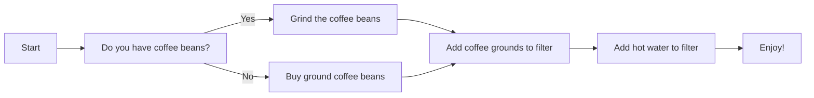

# Mermaid Flow Diagram in Markdown

```mermaid
flowchart LR
      A[Start]-->B[Do you have coffee beans?]
      B-->|Yes|C[Grind the coffee beans]
      B-->|No|D[Buy ground coffee beans]
      C-->E[Add coffee grounds to filter]
      D-->E
      E-->F[Add hot water to filter]
      F-->G[Enjoy!]

```
